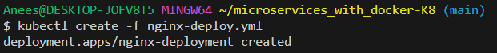
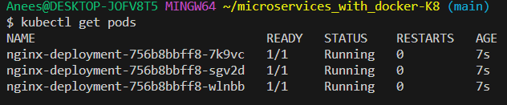
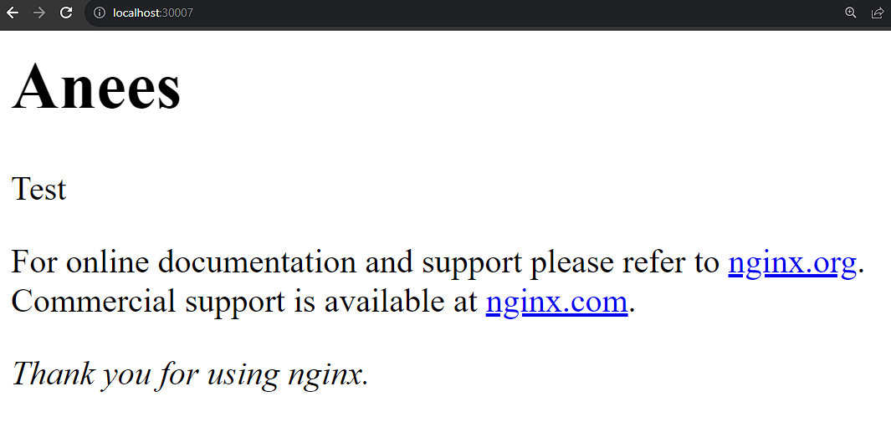

# Why Use Kubernetes (K8s)?

Kubernetes is a platform designed to automate the deployment, scaling, and management of containerized applications.

## Benefits of Kubernetes

- **Automated Scaling:** 
  - K8s can automatically adjust the number of containers based on the demand, ensuring efficient use of resources.
  
- **Self-healing Capabilities:**
  - It can automatically replace failed containers, reschedule, and even restart them, which enhances reliability and uptime.
  
- **Load Balancing:**
  - Kubernetes can automatically distribute network traffic to ensure stability during high-traffic periods.

- **Multi-Cloud and Cross-Cloud Support:**
  - K8s can run on various cloud platforms, showing its flexibility and avoiding vendor lock-in.

  
- **Easy Deployment and Rollback:**
  - It allows for easy updates and rollbacks of applications, makning deplyoment process smoother.

## When Not to Use Kubernetes

- **Small-Scale Projects:**
  - For smaller projects or applications, Kubernetes might be overkill. Simpler container management tools might be more suitable.
  
- **Limited Expertise:**
  - If the team lacks expertise in Kubernetes, it might be challenging to implement and maintain effectively.
  
- **Cost Concerns:**
  - Kubernetes can be resource-intensive, it might not be the most economical choice.

---

## Using Kubernetes

### Create Deployment YAML File

Create a YAML file for deployment.

```yaml
apiVersion: apps/v1
kind: Deployment
metadata:
  name: nginx-deployment
spec:
  selector:
    matchLabels:
      app: nginx
  replicas: 3  # Number of pod replicas
  template:
    metadata:
      labels:
        app: nginx
    spec:
      containers:
        - name: nginx
          image: aneesasif/ngingx-254:latest 
          ports:
            - containerPort: 80
```


### Create and Run Pods

1. Deploy the application using `kubectl create` command:

   ```
   kubectl create -f nginx_deployment.yml
   ```

   

2. Verify that the pods are running:

   ```
   kubectl get pods
   ```

   

### Exposing the Application

Create a service YAML file to expose your application:

```yaml
apiVersion: v1
kind: Service
metadata:
  name: nginx-service
spec:
  type: NodePort  # Exposes the service outside of the cluster
  selector:
    app: nginx  # Selects the pods with label 'app: nginx'
  ports:
    - port: 80
      targetPort: 80  # The port on the pod
      nodePort: 30007  # The port accessible outside the cluster
```

Apply this configuration using `kubectl apply`. After applying, your Nginx pods should be accessible at http://localhost:30007 (or whichever `nodePort` you've specified).



---

### Implement node-app

### Step 1: Create Deployment YAML for Node.js App

Create a YAML file (e.g., `node-app-deployment.yml`) for deploying your Node.js application:

```yaml
apiVersion: apps/v1
kind: Deployment
metadata:
  name: node-app-deployment
spec:
  replicas: 2  # Adjust the number of replicas based on your computer's capacity
  selector:
    matchLabels:
      app: node-app
  template:
    metadata:
      labels:
        app: node-app
    spec:
      containers:
        - name: node-app
          image: aneesasif/sparta-app:latest  # Replace with your Node.js app image
          ports:
            - containerPort: 3000  # Adjust if your app listens on a different port
```

### Step 2: Deploy the Node.js Application

Deploy the application using the `kubectl create` command:

```bash
kubectl create -f node-app-deployment.yml
```

### Step 3: Create a Service YAML for Node.js App

Choose between LoadBalancer and NodePort. Below are both options:

#### Option 1: Using NodePort

Create a YAML file (e.g., `node-app-service.yml`) for the NodePort service:

```yaml
apiVersion: v1
kind: Service
metadata:
  name: node-app-service
spec:
  type: NodePort
  selector:
    app: node-app
  ports:
    - port: 3000
      targetPort: 3000
      nodePort: 30007  # Choose a port from the range 30000-32767
```

#### Option 2: Using LoadBalancer

Create a YAML file (e.g., `node-app-service.yml`) for the LoadBalancer service:

```yaml
apiVersion: v1
kind: Service
metadata:
  name: node-app-service
spec:
  type: LoadBalancer
  selector:
    app: node-app
  ports:
    - port: 3000
      targetPort: 3000
```

### Step 4: Deploy the Service

Deploy the service using the `kubectl apply` command:

```bash
kubectl apply -f node-app-service.yml
```

### Step 5: Access the Application

Access your Nodejs app by visitng localhost, followed by the port you assigned. So either localhost:3000 for the load balancer or localhost:30007 for node port.
