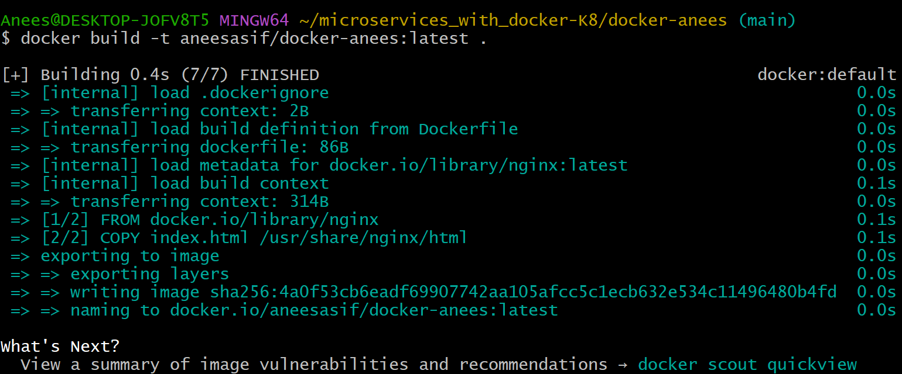
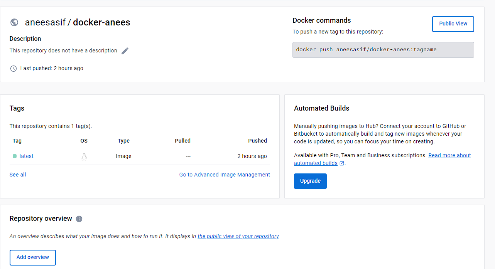
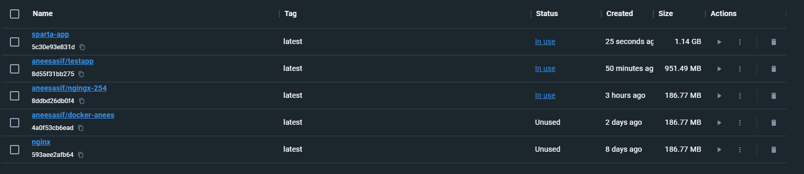
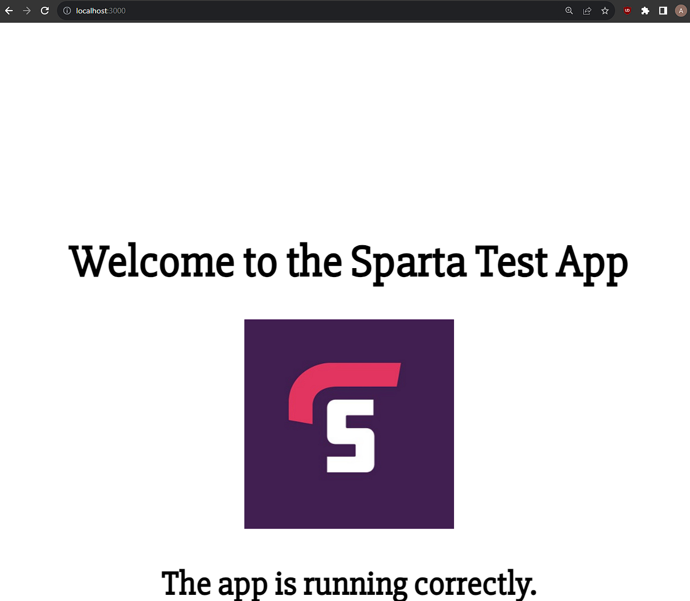
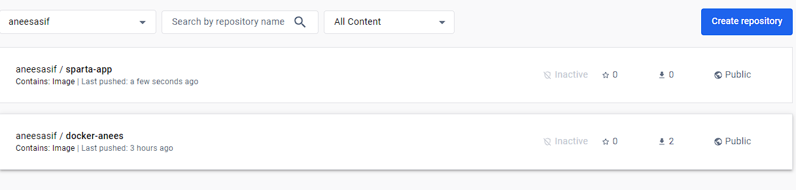

## Using Nginx with Docker
---

### Run Nginx Container

```bash
docker run -d -p 80:80 nginx
```

- `-d` is for detached mode, which runs the container in the background and frees up the terminal.

---

### Setting Docker Alias (Windows Users)

```bash
alias docker="winpty docker"
```

- This alias is useful for Windows users to enable a pseudo-TTY, which Docker needs for the `exec` command.

---

### Connect to Running Container

```bash
docker exec -it 5e6c470411b2 sh
```

- Use `docker exec -it` followed by the container ID to connect to the running container via shell (`sh`).

---

### Update and Install Packages Inside the Container

Enter the following commands to update packages and install `nano` and `sudo`.

```bash
apt update -y
apt upgrade -y
apt install nano
apt install sudo
```

---

### Edit Nginx `index.html`

Navigate to the Nginx default HTML directory:

```bash
cd /usr/share/nginx/html
```

Open `index.html` with `nano`:

```bash
nano index.html
```

- Make your desired changes to the file.

---

### See the Updated Web Page

After saving your changes in `nano`, simply refresh the Nginx web page in your browser to see the updated version.


---

## Creating nginx docker image 

1. Create a new directory on your local machine, for example, named `my-nginx-profile`.
    ```bash
    mkdir my-nginx-profile && cd my-nginx-profile
    ```
2. Create a file named index.html enter what you want.
 
3. Create a `Dockerfile` in `my-nginx-profile` with the following content:
    ```
   
# which image
FROM nginx

# what to copy
COPY index.html /usr/share/nginx/html/
# port 80
EXPOSE 80
# cmd specific instructions
CMD ["nginx", "-g", "daemon off;"]

    ```
4. Build the Docker image:
    ```bash
    docker build -t aneesasif/ngingx-254 .
    ```


`docker run -d -p 80:80 aneesasif/ngingx-254`

### Push to Docker Hub
1. Log in to Docker Hub from the command line if you haven't already:
    ```bash
    docker login
    ```
2. Push the image:
    ```bash
    docker push your-docker-username/my-nginx-profile:latest
    ```

Replace `your-docker-username` with the username you chose when you created your Docker account. Now your customized Nginx image will be available on Docker Hub, and you can pull it or run containers from it on any machine.




## Creating an App Using Docker

Start by creating a folder named `app` and place your Sparta test application inside. Also, make sure to include a Dockerfile with the following content:

```Dockerfile
FROM node:latest
WORKDIR /app
COPY . .
RUN npm install
EXPOSE 3000
CMD [ "node", "app.js" ]
```

To build the Docker image, navigate to the directory containing your Dockerfile and run the following command. This will save the image as `sparta-app`:

```bash
docker build -t sparta-app .
```



To run the image, map port 3000 of the container to port 3000 of your host machine:

```bash
docker run -d -p 3000:3000 sparta-app
```

You should now be able to access the application running on your local host at port 3000.



To push your Docker image to Docker Hub, run the following command:

```bash
docker push aneesasif/sparta-app
```

The image should now be uploaded to your Docker Hub account.



---